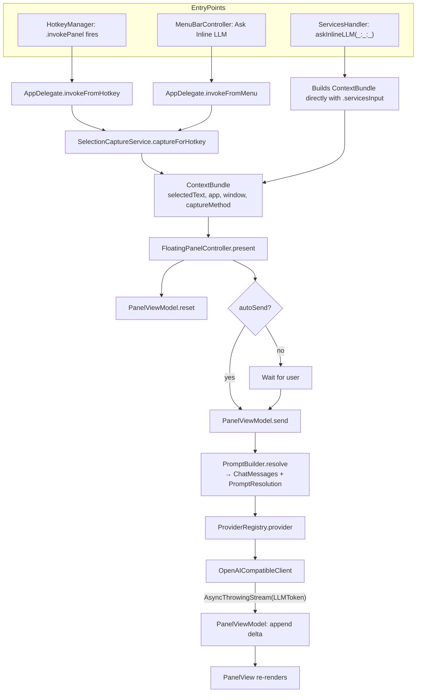

# Architecture

This document explains how the Inline LLM Lens codebase is organized, how a single user invocation flows end-to-end, and the conventions you should follow when extending it. For *what* the app does and *why*, read [`../mvp_spec.md`](../mvp_spec.md).

## Guiding principles

1. **Inline lens, not chat app.** Every architectural choice should keep invocation latency low and the UI footprint small. If you find yourself adding a window, sidebar, or persistent state, stop and reread the spec's positioning section (§3).
2. **Provider-agnostic at the seams.** A single `LLMProvider` protocol guards all external LLM calls. The MVP ships only `OpenAICompatibleClient`, but everything downstream of the provider should be ignorant of vendor specifics.
3. **Capture is best-effort and layered.** Different macOS apps expose selected text in wildly different ways. The capture pipeline tries strategies in priority order and degrades gracefully to manual input.
4. **Privacy-conservative.** No telemetry. No background capture. The app reads pasteboards or AX selections only on explicit user invocation.

## Module map

The codebase is organized by feature module under `InlineLLMLens/`. Each module is a folder; inter-module dependencies flow downward in the list below (no module depends on a module above it):

| Module | Purpose |
| --- | --- |
| `Util/` | Cross-cutting helpers: `AppLogger` (os.Logger wrapper), `Debouncer`, `LaunchAtLogin` (SMAppService). |
| `Storage/` | `KeychainStore` (Keychain Services wrapper), `SettingsStore` (typed `UserDefaults` facade), `LocalHistoryStore` (optional, off by default). |
| `Models/` | `ModelConfig` (Codable struct describing one provider+model+key combo), `ProviderKind` enum, `ModelStore` (CRUD + persistence). |
| `LLM/` | `LLMProvider` protocol, request/response/error types, `OpenAICompatibleClient`, `ProviderRegistry` (maps `ModelConfig.provider` → concrete client). |
| `Prompt/` | `PromptBuilder` — variable expansion (`{{selection}}`, `{{userInput}}`, `{{app}}`, `{{windowTitle}}`, `{{date}}`) and message assembly. |
| `Prompts/` | `PromptPreset` (user-defined recipe: system prompt + behavior flags + optional model / inference overrides + per-preset hotkey) and `PromptPresetStore` (CRUD, persistence, import/export). |
| `Capture/` | `ContextBundle` and `CaptureMethod` data types, individual capture strategies (`AccessibilityCapture`, `ClipboardFallbackCapture`, `ManualInputCapture`), and the orchestrating `SelectionCaptureService`. |
| `Hotkey/` | `HotkeyManager` (thin wrapper over the `KeyboardShortcuts` SPM package) and `ShortcutNames` (typed shortcut identifiers). |
| `Services/` | `ServicesHandler` — exposes the `@objc askInlineLLM(_:userData:error:)` selector that macOS Services calls. |
| `MenuBar/` | `MenuBarController` — owns the `NSStatusItem` and its `NSMenu`. |
| `Panel/` | The floating response panel: `FloatingPanel` (NSPanel subclass), `FloatingPanelController`, `PanelPositioner`, `PanelView` (SwiftUI), `PanelViewModel`, plus subviews (`PresetPicker`, `ModelPicker`, `MarkdownResponseView`). |
| `Settings/` | SwiftUI `Settings { }` scene with five tabs: General, Models, Prompts, Capture, Permissions. |
| `Onboarding/` | First-launch onboarding window. |
| `App/` | Entry point: `InlineLLMLensApp` (SwiftUI `@main`), `AppDelegate` (wires everything together), `Info.plist`, entitlements. |

## Request pipeline

A single invocation flows through these stages:



### Stage details

**Capture.** `SelectionCaptureService.captureForHotkey()` runs strategies in priority order and tags the resulting `ContextBundle` with the method that produced it:

1. `.accessibility` — `AXUIElementCopyAttributeValue(focusedElement, kAXSelectedTextAttribute)`, with a bounded BFS through children if the focused element doesn't directly expose selected text. Many apps put the focused element on a container (window, scroll view) and the actual text-bearing element is a descendant.
2. `.clipboardFallback` — only if the user opted in (Settings → Capture). Saves the current pasteboard, simulates Cmd+C via `CGEvent`, reads the result, restores the pasteboard.
3. `.manualInput` — empty bundle with no selection. The panel opens with a text field for the user to type/paste into.

The Services entry point (`.servicesInput`) bypasses this orchestration entirely — macOS hands the selected text directly to `ServicesHandler` via the system pasteboard, which is the most reliable capture method.

**Prompt assembly.** `PromptBuilder.resolve(preset:bundle:userInput:model:)` returns `(messages: [ChatMessage], resolution: PromptResolution)`:

- The **system message** is the active `PromptPreset.systemPrompt` with template variables expanded — `{{selection}}`, `{{userInput}}`, `{{app}}`, `{{windowTitle}}`, `{{date}}`. Unknown variables pass through verbatim so authors notice them in the response (and the editor's preview pane warns about them).
- The **user message** is the captured selected text, verbatim. There's no second author-controlled user template — the contract is "system prompt instructs, user message is the selection".
- The `PromptResolution` snapshot captures the rendered messages plus the effective model and inference parameters. This is what `LocalHistoryStore` records so re-reading old history always shows what actually went over the wire even after the source preset is edited or deleted.

**Per-preset overrides.** A `PromptPreset` can pin a `preferredModelID` and override `temperature`, `maxOutputTokens`, and `reasoningEffort`. Each is nullable and falls back to whatever the model itself has configured. Reasoning effort is treated as opaque text (`"minimal"`, `"low"`, `"high"`, `"xhigh"`, …) and only emitted to providers that accept the field.

**Provider dispatch.** `ProviderRegistry.provider(for: ModelConfig)` switches on `ModelConfig.provider` and returns a concrete `LLMProvider`. Today the only case is `.openAICompatible` → `OpenAICompatibleClient`. To add Anthropic native, see [`EXTENDING.md`](EXTENDING.md).

**Streaming.** `OpenAICompatibleClient.streamResponse(request:)` returns `AsyncThrowingStream<LLMToken, Error>`:

- Builds an `URLRequest` against `<baseURL>/chat/completions`.
- Body: standard OpenAI Chat Completions JSON. `reasoning_effort` is included only when the model has it set (so non-reasoning models keep getting clean payloads).
- Authorization: `Bearer <key>`, except for `localhost` / `127.0.0.1` / `::1` hosts where the key is optional (Ollama, LM Studio).
- Uses a dedicated URLSession (`makeStreamingSession`) with `urlCache = nil` and `requestCachePolicy = .reloadIgnoringLocalCacheData` — `URLSession.shared`'s default cache buffers chunked SSE responses.
- Iterates `bytes.lines`, parses `data: …` lines, decodes each chunk's `choices[0].delta.content`, yields `LLMToken` values.
- Logs `LLM stream request started`, `LLM headers received in N.NNs`, `LLM first delta in N.NNs` to the `com.inlinellmlens` logger subsystem so you can diagnose latency.

**Response render.** `PanelViewModel` owns a `streamingText: String` that the SwiftUI view binds to. Tokens are appended on the main actor. When the stream finishes, the assistant message is appended to `conversation: [ChatMessage]` so follow-ups have full context.

## Key types

These are the few types you should internalize before changing anything:

- `ContextBundle` (`Capture/ContextBundle.swift`) — the per-invocation envelope: `selectedText`, `frontmostAppName`, `frontmostWindowTitle`, `captureMethod`, `timestamp`. Future richer context (surrounding text, URL, screenshot) will be added here.
- `CaptureMethod` (`Capture/CaptureMethod.swift`) — `servicesInput | accessibility | clipboardFallback | manualInput`. Surfaced in the panel's diagnostics footer for debugging.
- `PromptPreset` (`Prompts/PromptPreset.swift`) — user-defined recipe. Owns the system prompt template plus behavior flags (`requiresUserInput`, `requiresSelection`, `autoSend`), optional `preferredModelID` / `temperature` / `maxOutputTokens` / `reasoningEffort` overrides, dropdown pinning, and stable hotkey identifier (`hotkeyShortcutKey`).
- `PromptResolution` (`Prompt/PromptBuilder.swift`) — snapshot of how a single invocation was rendered. Stored on history entries so editing a preset later never rewrites the past.
- `ModelConfig` (`Models/ModelConfig.swift`) — one provider+model+key triple. `apiKeyReference` is the Keychain account name (defaults to the model's UUID). `reasoningEffort: String?` is sent verbatim as `reasoning_effort` when non-empty.
- `LLMProvider` (`LLM/LLMProvider.swift`) — `streamResponse(request:)` and `complete(request:)`. The seam at which provider implementations swap.
- `LLMRequest` / `ChatMessage` / `Role` (`LLM/LLMRequest.swift`) — provider-neutral request shape.
- `LLMToken` (`LLM/LLMToken.swift`) — one delta from the stream, plus a sentinel `final`.
- `LLMError` (`LLM/LLMError.swift`) — `missingAPIKey | invalidURL | http(status, body) | decoding | transport | cancelled`. Surface `errorDescription` to the UI.

## Threading model

- **Anything UI-touching is `@MainActor`.** That includes `AppDelegate`, `FloatingPanelController`, `PanelViewModel`, `ModelStore` (it's `@Published`-bound and mutated from views).
- **Network calls run on the cooperative thread pool.** `OpenAICompatibleClient` is a plain `final class` (not `@MainActor`); its async methods are called from a `Task` inside `PanelViewModel.runRequest`.
- **Token deltas marshal back to MainActor explicitly.** `await MainActor.run { self.streamingText += token.delta }`. Don't yield raw deltas onto a `@Published` property from a non-MainActor context — Swift's actor checker will eventually fail builds when strict concurrency tightens.
- **Capture strategies are async.** `SelectionCaptureService.captureForHotkey()` is `async`. Even though Accessibility queries are synchronous, clipboard fallback is genuinely async (it has to wait for `pasteboard.changeCount` to tick after simulating Cmd+C), so the orchestrator is uniformly async.

## App lifecycle and activation policy

The app is an `LSUIElement` (no Dock icon) menu-bar agent. Default activation policy is `.accessory`.

There's one wrinkle: SwiftUI's `Settings { }` scene only presents reliably under `.regular` activation policy. The fix in `AppDelegate.openSettings()`:

1. Switch to `.regular`.
2. `NSApp.activate(ignoringOtherApps: true)`.
3. Send `showSettingsWindow:` action.
4. Subscribe to `NSWindow.willCloseNotification` for the Settings window; switch back to `.accessory` when it closes.

This makes the Dock icon appear briefly while Settings is open, then vanish. Don't use a global `applicationDidResignActive` handler to revert the policy — that races with window presentation and can silently kill the Settings window. (We tried; see [`TROUBLESHOOTING.md`](TROUBLESHOOTING.md).)

## Storage layout

Persisted state lives in three places:

| What | Where | Format |
| --- | --- | --- |
| User preferences | `UserDefaults.standard` (keys under `settings.*`) | Native types |
| Configured models | `~/Library/Application Support/InlineLLMLens/models.json` | JSON, `[ModelConfig]` |
| API keys | macOS login Keychain, service `com.inlinellmlens`, account `<ModelConfig.id.uuidString>` | Generic password (`kSecClassGenericPassword`) |
| Local history (opt-in) | `~/Library/Application Support/InlineLLMLens/history.json` | JSON, `[LocalHistoryItem]` |
| Default model id | `UserDefaults` key `InlineLLMLens.defaultModelID` | UUID string |

`ModelStore` and `KeychainStore` both accept injectable `UserDefaults` / service identifiers in their initializers so tests can isolate from system state.

## Diagnostics surface

- The floating panel has a permanent footer showing AX trust state, capture method, and frontmost app: `AX: trusted · capture: accessibility · from: TextEdit`. Useful for any "why isn't this working in app X?" report.
- All notable events go through `AppLogger` (`Util/Logger.swift`), which writes to `os.Logger(subsystem: "com.inlinellmlens", category: "app")`. Live tail with:
  ```bash
  log stream --predicate 'subsystem == "com.inlinellmlens"' --level info
  ```
  Or for a window of past logs:
  ```bash
  log show --predicate 'subsystem == "com.inlinellmlens"' --info --last 5m
  ```

See [`DEVELOPMENT.md`](DEVELOPMENT.md) for more debugging recipes.

## Where the spec ends and the code begins

The spec ([`../mvp_spec.md`](../mvp_spec.md)) defines:

- Behavior (UX flows, prompt modes, panel layout, settings, acceptance criteria).
- Constraints (privacy stance, non-goals, MVP non-goals).
- Forward-looking shape (later features, future context bundle, app adapters).

The code:

- Implements the spec's Milestones 1–7 (§21).
- Adds the small handful of pragmatic decisions the spec explicitly leaves open: choice of OpenAI-compatible-only provider for MVP, choice of XcodeGen for project generation, choice of `KeyboardShortcuts` and `MarkdownUI` SPM dependencies, the `reasoning_effort` model field.

If the code and the spec disagree, the spec wins — file an issue or ask the spec owner before "fixing" the code.
