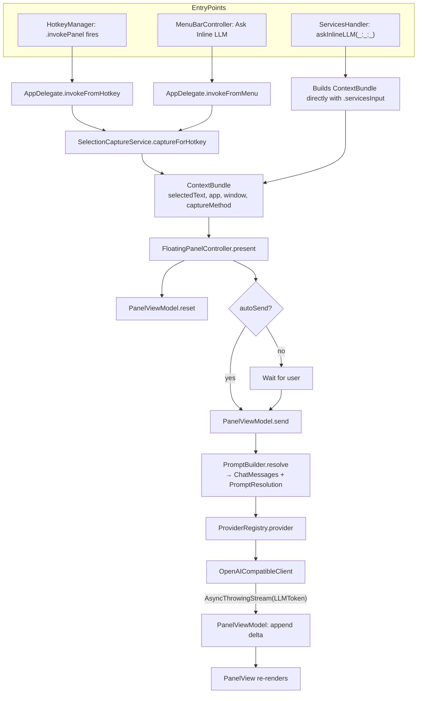

# Architecture

This document explains how the Inline LLM Lens codebase is organized, how a single user invocation flows end-to-end, and the conventions you should follow when extending it.

## Guiding principles

1. **Inline lens, not chat app.** Every architectural choice should keep invocation latency low and the UI footprint small. If you find yourself adding a window, sidebar, or persistent state, stop and reconsider — this app is positioned as an inline semantic lens (closer to Spotlight / PopClip / Apple Dictionary lookup), not a chat UI.
2. **Provider-agnostic at the seams.** A single `LLMProvider` protocol guards all external LLM calls. Currently only `OpenAICompatibleClient` ships, but everything downstream of the provider should be ignorant of vendor specifics.
3. **Capture is best-effort and layered.** Different macOS apps expose selected text in wildly different ways. The capture pipeline tries strategies in priority order and degrades gracefully to manual input.
4. **Privacy-conservative.** No telemetry. No background capture. The app reads pasteboards or AX selections only on explicit user invocation.

## Module map

The codebase is organized by feature module under `InlineLLMLens/`. Each module is a folder; inter-module dependencies flow downward in the list below (no module depends on a module above it):

| Module | Purpose |
| --- | --- |
| `Util/` | Cross-cutting helpers: `AppLogger` (os.Logger wrapper), `Debouncer`, `LaunchAtLogin` (SMAppService). |
| `Storage/` | `KeychainStore` (Keychain Services wrapper), `SettingsStore` (typed `UserDefaults` facade), `LocalHistoryStore` (full-resolution history, off by default), `QueryHistoryStore` (per-preset rolling list of recent queries powering the panel's history dropdown, on by default with a low cap). |
| `Models/` | `ModelConfig` (Codable struct describing one provider+model+key combo), `ProviderKind` enum, `ModelStore` (CRUD + persistence). |
| `LLM/` | `LLMProvider` protocol, request/response/error types, `OpenAICompatibleClient`, `ProviderRegistry` (maps `ModelConfig.provider` → concrete client). |
| `Prompt/` | `PromptBuilder` — variable expansion (`{{selection}}`, `{{userInput}}`, `{{app}}`, `{{windowTitle}}`, `{{date}}`) and message assembly. |
| `Prompts/` | `PromptPreset` (user-defined recipe: system prompt + behavior flags + optional model / inference overrides + per-preset hotkey) and `PromptPresetStore` (CRUD, persistence, import/export). |
| `Capture/` | `ContextBundle` and `CaptureMethod` data types, individual capture strategies (`AccessibilityCapture`, `ClipboardFallbackCapture`, `ManualInputCapture`), and the orchestrating `SelectionCaptureService`. |
| `Hotkey/` | `HotkeyManager` (thin wrapper over the `KeyboardShortcuts` SPM package) and `ShortcutNames` (typed shortcut identifiers). |
| `Services/` | `ServicesHandler` — exposes the `@objc askInlineLLM(_:userData:error:)` selector that macOS Services calls. |
| `MenuBar/` | `MenuBarController` — owns the `NSStatusItem` and its `NSMenu`. |
| `Panel/` | The floating response panel: `FloatingPanel` (borderless `NSPanel`, with `cancelOperation(_:)` + `performKeyEquivalent(with:)` overrides for panel-level Esc / ⌘C handling), `FloatingPanelController` (wires Esc + ⌘C fallback, observes `didResignKeyNotification` for click-off behaviour, applies `panel.level` and `NSApp.activationPolicy` per the user's setting, persists user-initiated resizes back to the active preset via `didEndLiveResize`), `PanelPositioner` (near-cursor / centered-on-cursor / centered-on-screen, with optional per-invocation `sizeOverride`), `PanelAppearanceResolver` (translates the appearance setting — system / light / dark / custom hex — into background fill, text-color override, and forced `ColorScheme`), `PanelView` (SwiftUI — chromeless, response-first layout, with `.onKeyPress(.return)` wiring so bare Return sends in the preset input field, ⌘+/⌘− shortcuts that mutate `SettingsStore.panelFontSize`, and a small clock-icon `Menu` driven by `QueryHistoryStore`), `PanelViewModel`, plus subviews (`PresetPicker`, `ModelPicker`, `MarkdownResponseView`). |
| `Settings/` | AppKit-owned settings window (`SettingsWindowController` — an `NSWindow` + `NSHostingController` hosting `SettingsRoot`) with five tabs: General, Models, Prompts, Capture, Permissions. Deliberately not the SwiftUI `Settings { }` scene — see the "App lifecycle and activation policy" section below for rationale. |
| `Onboarding/` | First-launch onboarding window. |
| `App/` | Entry point: `InlineLLMLensApp` (SwiftUI `@main`), `AppDelegate` (wires everything together), `Info.plist`, entitlements. |

## Request pipeline

A single invocation flows through these stages:



### Stage details

**Capture.** `SelectionCaptureService.captureForHotkey()` runs strategies in priority order and tags the resulting `ContextBundle` with the method that produced it:

1. `.accessibility` — `AXUIElementCopyAttributeValue(focusedElement, kAXSelectedTextAttribute)`, with a bounded BFS through children if the focused element doesn't directly expose selected text. Many apps put the focused element on a container (window, scroll view) and the actual text-bearing element is a descendant.
2. `.clipboardFallback` — Cmd+C simulation. **On by default.** Saves the current pasteboard, simulates Cmd+C via `CGEvent`, reads the result, restores the pasteboard. The only path that captures *highlighted* text in apps where AX returns nothing (Chrome, Cursor, Slack, most Electron). Runs *before* `.clipboardCurrent` so an active selection wins over whatever stale text happens to be on the clipboard.
3. `.clipboardCurrent` — read `NSPasteboard.general` as-is, no mutation. Picks up the case "I just copied something and want to ask about it" without requiring a selection.
4. `.manualInput` — empty bundle with no selection. The panel opens with a text field for the user to type/paste into.

The Services entry point (`.servicesInput`) bypasses this orchestration entirely — macOS hands the selected text directly to `ServicesHandler` via the system pasteboard, which is the most reliable capture method.

**Prompt assembly.** `PromptBuilder.resolve(preset:bundle:userInput:model:)` returns `(messages: [ChatMessage], resolution: PromptResolution)`:

- The **system message** is the active `PromptPreset.systemPrompt` with template variables expanded — `{{selection}}`, `{{userInput}}`, `{{app}}`, `{{windowTitle}}`, `{{date}}`. Unknown variables pass through verbatim so authors notice them in the response (and the editor's preview pane warns about them).
- The **user message** is the captured selected text, verbatim. There's no second author-controlled user template — the contract is "system prompt instructs, user message is the selection".
- The `PromptResolution` snapshot captures the rendered messages plus the effective model and inference parameters. This is what `LocalHistoryStore` records so re-reading old history always shows what actually went over the wire even after the source preset is edited or deleted.

**Per-preset overrides.** A `PromptPreset` can pin a `preferredModelID` and override `temperature`, `maxOutputTokens`, and `reasoningEffort`. Each is nullable and falls back to whatever the model itself has configured. Reasoning effort is treated as opaque text (`"minimal"`, `"low"`, `"high"`, `"xhigh"`, …) and only emitted to providers that accept the field.

**Provider dispatch.** `ProviderRegistry.provider(for: ModelConfig)` switches on `ModelConfig.provider` and returns a concrete `LLMProvider`. Today the only case is `.openAICompatible` → `OpenAICompatibleClient`. To add Anthropic native, see [`EXTENDING.md`](EXTENDING.md).

**Streaming.** `OpenAICompatibleClient.streamResponse(request:)` returns `AsyncThrowingStream<LLMToken, Error>`:

- Builds an `URLRequest` against `<baseURL>/chat/completions`.
- Body: standard OpenAI Chat Completions JSON. `reasoning_effort` is included only when the model has it set (so non-reasoning models keep getting clean payloads).
- Authorization: `Bearer <key>`, except for `localhost` / `127.0.0.1` / `::1` hosts where the key is optional (Ollama, LM Studio).
- Uses a dedicated URLSession (`makeStreamingSession`) with `urlCache = nil` and `requestCachePolicy = .reloadIgnoringLocalCacheData` — `URLSession.shared`'s default cache buffers chunked SSE responses.
- Iterates `bytes.lines`, parses `data: …` lines, decodes each chunk's `choices[0].delta.content`, yields `LLMToken` values.
- Logs `LLM stream request started`, `LLM headers received in N.NNs`, `LLM first delta in N.NNs` to the `com.inlinellmlens` logger subsystem so you can diagnose latency.

**Response render.** `PanelViewModel` owns a `streamingText: String` that the SwiftUI view binds to. Tokens are appended on the main actor. When the stream finishes, the assistant message is appended to `conversation: [ChatMessage]` so follow-ups have full context.

## Key types

These are the few types you should internalize before changing anything:

- `ContextBundle` (`Capture/ContextBundle.swift`) — the per-invocation envelope: `selectedText`, `frontmostAppName`, `frontmostWindowTitle`, `captureMethod`, `timestamp`. Future richer context (surrounding text, URL, screenshot) will be added here.
- `CaptureMethod` (`Capture/CaptureMethod.swift`) — `servicesInput | accessibility | clipboardFallback | manualInput`. Available as a `UserDefaults` / log field for debugging; no longer shown in the panel UI.
- `PromptPreset` (`Prompts/PromptPreset.swift`) — user-defined recipe. Owns the system prompt template plus behavior flags (`requiresUserInput`, `requiresSelection`, `autoSend`), optional `preferredModelID` / `temperature` / `maxOutputTokens` / `reasoningEffort` overrides, optional per-preset panel size (`panelWidth`, `panelHeight`), dropdown pinning, and stable hotkey identifier (`hotkeyShortcutKey`). All optional fields are `decodeIfPresent`-friendly so older on-disk catalogs decode cleanly.
- `QueryHistoryEntry` (`Storage/QueryHistoryStore.swift`) — one history dropdown entry: `text` (effective selection), `userInput`, `responseText`, optional `modelID`, `timestamp`. Custom decoder backfills missing fields on older on-disk entries.
- `PromptResolution` (`Prompt/PromptBuilder.swift`) — snapshot of how a single invocation was rendered. Stored on history entries so editing a preset later never rewrites the past.
- `ModelConfig` (`Models/ModelConfig.swift`) — one provider+model+key triple. `apiKeyReference` is the Keychain account name (defaults to the model's UUID). `reasoningEffort: String?` is sent verbatim as `reasoning_effort` when non-empty.
- `LLMProvider` (`LLM/LLMProvider.swift`) — `streamResponse(request:)` and `complete(request:)`. The seam at which provider implementations swap.
- `LLMRequest` / `ChatMessage` / `Role` (`LLM/LLMRequest.swift`) — provider-neutral request shape.
- `LLMToken` (`LLM/LLMToken.swift`) — one delta from the stream, plus a sentinel `final`.
- `LLMError` (`LLM/LLMError.swift`) — `missingAPIKey | invalidURL | http(status, body) | decoding | transport | cancelled`. Surface `errorDescription` to the UI.

## Threading model

- **Anything UI-touching is `@MainActor`.** That includes `AppDelegate`, `FloatingPanelController`, `PanelViewModel`, `ModelStore` (it's `@Published`-bound and mutated from views).
- **Network calls run on the cooperative thread pool.** `OpenAICompatibleClient` is a plain `final class` (not `@MainActor`); its async methods are called from a `Task` inside `PanelViewModel.runRequest`.
- **Token deltas marshal back to MainActor explicitly.** `await MainActor.run { self.streamingText += token.delta }`. Don't yield raw deltas onto a `@Published` property from a non-MainActor context — Swift's actor checker will eventually fail builds when strict concurrency tightens.
- **Capture strategies are async.** `SelectionCaptureService.captureForHotkey()` is `async`. Even though Accessibility queries are synchronous, clipboard fallback is genuinely async (it has to wait for `pasteboard.changeCount` to tick after simulating Cmd+C), so the orchestrator is uniformly async.

## App lifecycle and activation policy

The app is an `LSUIElement` (no Dock icon) menu-bar agent. Default activation policy is `.accessory`. **Two subsystems flip the policy to `.regular` while their windows are alive** and revert on close: the Settings window and (depending on the user's click-off setting) the floating panel itself. They cooperate via a small "do I currently need `.regular`?" check so neither yanks the policy out from under the other.

**Settings window.** We deliberately do **not** use SwiftUI's `Settings { }` scene. It was flakey to reopen under `.accessory` activation policy — the previous implementation used a 100 ms delay and `NSApp.sendAction(Selector(("showSettingsWindow:")), …)` to work around it, had to close the floating panel before opening Settings, and still wouldn't reliably reopen from the panel's gear button. `InlineLLMLensApp.body` now contains an empty `Settings { EmptyView() }` purely to satisfy the `App` protocol, and Settings is instead owned by `SettingsWindowController` — a singleton wrapping an `NSWindow` + `NSHostingController(rootView: SettingsRoot())`.

`AppDelegate.openSettings()` does just three things:

1. Flip `NSApp.setActivationPolicy(.regular)` so the window can properly become key and gets a Cmd-Tab entry.
2. `NSApp.activate(ignoringOtherApps: true)`.
3. `SettingsWindowController.shared.show()`.

A `willCloseNotification` observer reverts the activation policy to `.accessory` when the Settings window closes, matching on `SettingsWindowController.isSettingsWindow(window)` (identity) rather than fragile title/identifier string heuristics. **Important:** the close handler also checks `panelController.requiresRegularActivationPolicy` and skips the revert when the floating panel is still alive in a mode that needs `.regular` — otherwise closing Settings while the panel is up would silently drop the panel's Cmd-Tab entry. The floating panel is never closed by opening Settings; `FloatingPanelController`'s click-off observer ignores `resignKey` when another of our own windows becomes key (`NSApp.keyWindow !== panel`), so the panel stays put regardless of the user's click-off-behaviour setting.

**Floating panel activation, sizing, and key handling.** The panel is presented in this exact order (the order matters — see the next paragraph for why):

1. `viewModel.reset(...)`.
2. `PanelPositioner.position(panel:placement:sizeOverride:)`. The override is computed per-invocation by `FloatingPanelController.resolvedPanelSize(for:)`, which always returns a definite size — either the active preset's `panelWidth` / `panelHeight` per dimension, or the default `460×380`. We never inherit the previous invocation's frame, otherwise `Ask` (tall) immediately followed by `Explain` (default) would keep the tall window.
3. **Activation policy** is set *now*, while the panel is still offscreen, via `applyActivationPolicyForCurrentMode(panelWillBecomeVisible: true)`. `Stay on top` and `Recede to background` switch to `.regular`; `Close` keeps `.accessory`.
4. `NSApp.activate(ignoringOtherApps: true)`.
5. `panel.makeKeyAndOrderFront(nil)`.

Steps 3 → 4 must happen in that order. Activating an `.accessory` app and only flipping to `.regular` afterwards (e.g. inside a `didBecomeKey` observer) leaves the app in `.regular` but never claims the OS-level frontmost slot — the app appears in Cmd+Tab but Cmd+Tab from the panel still highlights the *original* source app, exactly as if the panel weren't running. This was a real bug; don't re-introduce the deferred policy switch.

The panel's style mask is `[.borderless, .resizable, .fullSizeContentView]` — explicitly **not** `.nonactivatingPanel`, because non-activating panels never enter the system's active-app MRU list and Cmd+Tab skips past them. Selection capture has already completed by the time the panel is shown, so suppressing activation buys nothing.

User-initiated resizes are persisted back to the currently-active preset: `FloatingPanelController` observes `NSWindow.didEndLiveResizeNotification` (which fires only at the end of a mouse-drag resize, not for programmatic `setFrame`, so there's no feedback loop) and writes the rounded `frame.size` into `preset.panelWidth` / `preset.panelHeight`. Switching presets via the chip mid-session means subsequent resizes are attributed to the newly-selected preset.

Keyboard handling is intentionally pushed *down* to the `NSPanel` subclass rather than relying on SwiftUI's `.onExitCommand` / `.keyboardShortcut`, both of which depend on a specific SwiftUI view being focused:

- **Esc.** `FloatingPanel.cancelOperation(_:)` is overridden (and deliberately does *not* call `super` — the default walks the rest of the responder chain and, finding no handler, produces the "not valid" beep). It invokes an `onCancel` closure the controller installs, which first collapses the follow-up bar if open, otherwise closes the panel. `FloatingPanelController.close()` cancels any in-flight LLM stream via `viewModel.cancelStreaming()`. `PanelView.onExitCommand` is kept as a fallback for the case where a `TextField` is first responder. The Settings window uses the same pattern — a private `SettingsWindow` subclass overrides `cancelOperation(_:)` to call `performClose(nil)`.
- **⌘C.** `FloatingPanel.performKeyEquivalent(with:)` intercepts ⌘C. It first dispatches `copy:` down the responder chain via `NSApp.sendAction(#selector(NSText.copy(_:)), to: nil, …)`; if any view with an active text selection handles it, the selection goes to the clipboard and the shortcut is consumed. Only if nothing handles `copy:` does it call `onCopyFallback`, which writes the full response to the pasteboard.
- **⌘+ / ⌘= / ⌘−.** Hidden zero-opacity SwiftUI `Button`s in `PanelView.fontSizeShortcuts` mutate `SettingsStore.panelFontSize`, clamped to `panelFontSizeRange`. Both `=` (US natural) and `+` (with shift) bump up; `−` bumps down. Bound at panel level rather than via a `.commands` scene because this is a panel, not a document window.
- **Click-off behaviour.** `FloatingPanelController` observes `NSWindow.didResignKeyNotification` on the panel. On each resignKey (after hopping one runloop tick so `NSApp.keyWindow` is settled) it branches on `settings.panelClickOffBehavior`: *stay on top* is a no-op, *recede to background* lowers `panel.level` to `.normal`, *close* dismisses the panel and cancels any in-flight stream. Same-app resignKey (another of our windows took focus) is always ignored so Settings doesn't trip it. **Click-off never cancels streaming on its own** in the *stay on top* and *recede to background* modes — only the *close* mode (or an explicit Esc / ✕) does. Backgrounding the app is meant to be a low-friction "I'll come back to it" gesture.

Note: under `.accessory` policy the macOS top menu bar still belongs to whatever app was previously frontmost — accessory apps do not get a menu bar. That's why the panel itself surfaces a gear (⌘,) for Settings and the status-bar icon menu carries the rest of the app commands. Under the temporarily-promoted `.regular` policy (Stay on top / Recede to background), the app does get a top menu bar, but we don't currently populate it beyond the system-default items.

**Per-preset query history.** `QueryHistoryStore` is a `@MainActor ObservableObject` keyed by `presetID` → `[QueryHistoryEntry]`. Each entry captures the effective selection text, the user-input field, the streamed response, and the model UUID — enough to repaint the panel exactly as the user saw it on the original invocation. Recording happens at the end of `PanelViewModel.runRequest`'s success branch (cancelled or errored streams don't pollute the dropdown). Move-to-top dedupe is keyed on `(text, userInput)` so re-asking with a different instruction stores a distinct entry. The dropdown in `PanelView.queryHistoryMenu` is a `Menu` with `.menuStyle(.borderlessButton).menuIndicator(.hidden).fixedSize()` so it occupies ~18pt at the trailing edge of the selection-preview row and doesn't expand the row's footprint. `applyHistoryEntry(_:)` restores selection / user-input / response / model and clears any prior streaming/error state — ⌘↵ then re-asks fresh. The cap is `SettingsStore.queryHistoryLimit` (default 10, range 0–50; 0 disables recording and hides the dropdown).

**Hotkey handler registration.** `KeyboardShortcuts.onKeyDown(for:)` is *additive* — calling it twice for the same `Name` installs two handlers, and the library has no public per-name handler-removal API. `HotkeyManager.syncPresetHotkeys(...)` therefore calls `KeyboardShortcuts.removeAllHandlers()` first, then re-registers the global and per-preset handlers in one go. Any caller that wants to change bindings must go through `syncPresetHotkeys(...)`. The subscription to `presetStore.$presets` uses `.dropFirst()` so the synchronous current-value emission doesn't double-register at launch. Missing this detail previously caused per-preset hotkeys to fire multiple times per keypress, presenting the panel concurrently and appearing to crash the app.

## Storage layout

Persisted state lives in three places:

| What | Where | Format |
| --- | --- | --- |
| User preferences (autoSend, streamResponses, panelFontSize, panelPlacement, panelClickOffBehavior, panelAppearanceMode, panelCustomBackgroundHex, panelCustomTextHex, queryHistoryLimit, …) | `UserDefaults.standard` (keys under `settings.*`) | Native types / raw strings for enums |
| Configured models | `~/Library/Application Support/InlineLLMLens/models.json` | JSON, `[ModelConfig]` |
| Prompt presets | `~/Library/Application Support/InlineLLMLens/prompts.json` | JSON, `[PromptPreset]` (includes optional per-preset `panelWidth`/`panelHeight`) |
| API keys | macOS login Keychain, service `com.inlinellmlens`, account `<ModelConfig.id.uuidString>` | Generic password (`kSecClassGenericPassword`) |
| Per-preset query history (on by default; cap configurable, 0 disables) | `~/Library/Application Support/InlineLLMLens/query-history.json` | JSON, `[UUID: [QueryHistoryEntry]]` keyed by preset ID |
| Full local history (opt-in) | `~/Library/Application Support/InlineLLMLens/history.json` | JSON, `[LocalHistoryItem]` (each carries a `PromptResolution` snapshot) |
| Default model id | `UserDefaults` key `InlineLLMLens.defaultModelID` | UUID string |
| Default preset id | `UserDefaults` key `InlineLLMLens.defaultPresetID` | UUID string |
| Per-preset hotkeys | `UserDefaults` keys `KeyboardShortcuts.<prompt.preset.<uuid>>` | Managed by the KeyboardShortcuts SPM package |

`ModelStore` and `KeychainStore` both accept injectable `UserDefaults` / service identifiers in their initializers so tests can isolate from system state.

## Diagnostics surface

- The floating panel **no longer has a diagnostics footer**. AX trust state is surfaced as a small orange dot in the panel header (next to the gear icon) with a tooltip explaining the impact. All other capture metadata is available via logs.
- All notable events go through `AppLogger` (`Util/Logger.swift`), which writes to `os.Logger(subsystem: "com.inlinellmlens", category: "app")`. Live tail with:
  ```bash
  log stream --predicate 'subsystem == "com.inlinellmlens"' --level info
  ```
  Or for a window of past logs:
  ```bash
  log show --predicate 'subsystem == "com.inlinellmlens"' --info --last 5m
  ```

See [`DEVELOPMENT.md`](DEVELOPMENT.md) for more debugging recipes.
